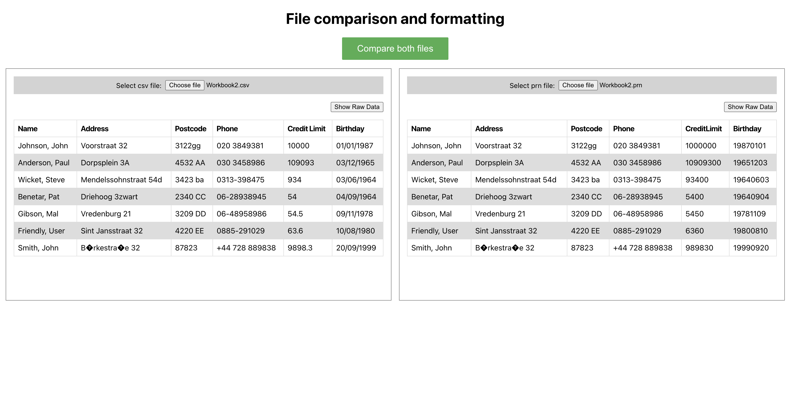

# Getting Started with Create React App

## Available Scripts

In the project directory, you can run:

### `npm install`

### [In case any error please run npm install --legacy-peer-deps]

### `npm start`

Runs the app in the development mode.\
Open [http://localhost:3000](http://localhost:3000) to view it in your browser.

The page will reload when you make changes.\
You may also see any lint errors in the console.

### `npm test`

Launches the test runner in the interactive watch mode.\
See the section about [running tests](https://facebook.github.io/create-react-app/docs/running-tests) for more information.

### `npm run build`

Builds the app for production to the `build` folder.\
It correctly bundles React in production mode and optimizes the build for the best performance.

The build is minified and the filenames include the hashes.\
Your app is ready to be deployed!

See the section about [deployment](https://facebook.github.io/create-react-app/docs/deployment) for more information.

# Data formatting web app

Given are two files - both contain the same content - one is a CSV file the other is a PRN file,
we want you write a simple web application that reads the CSV file and PRN file and, utilising
a simple UI:

- formats and displays the raw data appropriately.
- allows switching between an HTML table, and a formatted JSON display.
- that compares the generated outputs and reports a failure message if the outputs are not identical. The HTML generated from each input file should be identical, and the JSON generated from each file should be identical.

The content (i.e. the data in the file, minus the formatting characters) of the input files
differ, but you should produce identical output - irrespective of whether the input data format was CSV or PRN.
Non ASCII characters should be handled and rendered correctly.
No content should be lost in translation, but reformatting of content may be necessary
and all output should be readable when presented in the UI.

## Preview

